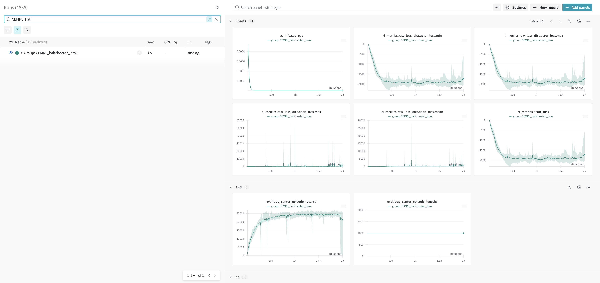
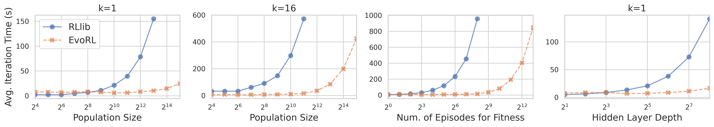
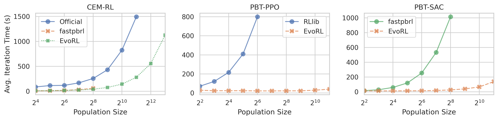

<h1 align="center">
  <a href="https://github.com/EMI-Group/evox">
  <picture>
    <source media="(prefers-color-scheme: dark)" srcset="./figs/evox_logo_dark.png">
    <source media="(prefers-color-scheme: light)" srcset="./figs/evox_logo_light.png">
      
  </picture>
  </a>
  <br>
</h1>

<h2 align="center">
    <p>🤖 EvoRL: A GPU-acclerated Framework for Evolutionary Reinforcement Learning 🧬</p>
</h2>


# Introduction

EvoRL is a fully GPU-acclerated framework for Evolutionary Reinforcement Learning (EvoRL), which is implemented by JAX and provides end-to-end training pipelines, including following processes optimized on GPUs:

* Reinforcement Learning (RL)
* Evolutionary Computation (EC)
* Environment Simulation

EvoRL provides a highly efficient and user-friendly platform to develop and evaluate RL, EC and EvoRL algorithms.
EvoGP is a sister project of <a href="https://github.com/EMI-Group/evox">EvoX</a>.


<!-- > “北冥有鱼，其名为鲲。化而为鸟，其名为鹏。怒而飞，其翼若垂天之云。”
> ——《庄子·逍遥游》 -->

## Highlight

* **Implementation of EvoRL algorithms**: We provide two popular paradigms in EvoRL: Evolution-guided Reinforcement Learning (ERL), e.g.: ERL, CEM-RL; and Population-based AutoRL: e.g.: PBT
* **End-to-end training pipelines**: The training pipelines for RL, EC and EvoRL are executed on GPUs, eliminating dense communication between CPUs and GPUs in traditional implementations and fully utilizing the parallel computing capabilities of modern GPU architectures. Besides, most algorithms has a `Workflow.stpe()` function that is capable of `jax.jit` and `jax.vmap()`, supporting parallel training and JIT on full computation graph and.
* **Easy integration between EC to RL**: Due to modular design, EC components can be easily plug-and-play in workflows.
* **Object-oriented functional programming model**: Classes define the static execution logic and their running states are stored externally.


# Installation

For normal users, `jax` should be installed first, please following their [official guide](https://jax.readthedocs.io/en/latest/quickstart.html#installation). Then you can use EvoRL by cloning the repo and pip install in editable mode.

```shell
# It will install the evorl package from source
git clone https://github.com/EMI-Group/evorl.git
cd evorl
pip install -e .
```
For developers: see [CONTRIBUTING.md](./CONTRIBUTING.md)


# Quickstart


## Training

EvoRL uses [hydra](https://hydra.cc/) to manage configs and run algorithms. We provide training script `python -m evorl.train` to run algorithms from CLI. You can specify the `agent` (algorithm) and `env` field based on the related config file path (`*.yaml`) in `configs` folder.

```text
# hierarchy of folder `configs/`
configs
├── agent
│   ├── ppo.yaml
│   ├── ...
...
├── config.yaml
├── env
│   ├── brax
│   │   ├── ant.yaml
│   │   ├── ...
│   ├── envpool
│   └── gymnax
└── logging.yaml
```


For example: To train the PPO agent with config file in `configs/agent/ppo.yaml` on environment Ant with config file in `configs/env/brax/ant.yaml`, type the following command:

```shell
python -m evorl.train agent=ppo env=brax/ant
```

Then the PPO algorithm starts training. If multiple GPUs are detected, most algorithms will automatically be trained in distributed mode.

### Advanced usage


```shell
# Train agent with config file in `configs/agnet/exp/ppo/brax/ant.yaml`,
# and override some options from cli
python -m evorl.train agent=exp/ppo/brax/ant env=gymnax/CartPole-v1 agent_network.continuous_action=false

# By adding -m option, enable multi runs in sequential
# eg: sweep over multiple config values (seed=114 or seed=514):
# Note: the log are stored in `./multirun/train/<timestamp>/<exp-name>/` instead.
python -m evorl.train -m agent=exp/ppo/brax/ant env=brax/ant seed=114,514
```

### Train multiple agents in parallel (Advanced)

We also provide a script `python -m evorl.train_dist` to train multiple algorithms with different options in parallel.

Additional packages are required:
```shell
# need to install joblib plugin before the first run
pip install -U hydra-joblib-launcher
```

```shell
# sweep over multiple config values in parallel (for multi-GPU case)
python -m evorl.train_dist -m agent=exp/ppo/brax/ant env=brax/ant seed=114,514 hydra/launcher=joblib

# sweep over multiple config values in sequence
python -m evorl.train_dist -m agent=exp/ppo/brax/ant env=brax/ant seed=114,514

# optional: specify the gpu ids used for parallel training
CUDA_VISIBLE_DEVICES=0,5 python -m evorl.train_dist -m agent=exp/ppo/brax/ant env=brax/ant seed=114,514 hydra/launcher=joblib

```

Note:

- It's recommended to run every job on a single device. By default, the script will use all detected GPUs and run every job on a dedicated GPU.

- If you persist in parallel training on a single device, set environment variables like `XLA_PYTHON_CLIENT_MEM_FRACTION=.10` or `XLA_PYTHON_CLIENT_PREALLOCATE=false` to avoid the OOM from JAX's pre-allocation.

- If the number of submitted jobs exceeds the number of CPU cores, joblib will wait and reuse previous processes. This could cause misconfigured GPU settings. To solve it, append `hydra.launcher.n_jobs=<#jobs>` to the script.


## Logging

When launching algorithms from the training scripts, the log file and checkpoint files will be stored in `./outputs/train|train_dist/<timestamp>/<exp-name>/`, or in `./multirun/train|train_dist/<timestamp>/<exp-name>/` when using `-m` option for multiple runs.

By default, the script will enable two recorders for logging: `LogRecorder` and `WandbRecorder`. `LogRecorder` will save logs (`*.log`) in the above path, and `WandbRecorder` will upload the data to (WandB)[https://wandb.ai/site/], which provides beautiful visualizations.

The screenshot in WandB dashboard:



Besides these recorders, we also provide the `JsonRecorder` and allow users to customize their own recorders.


# Algorithms

Currently, EvoRL supports 4 types of algorithms

| Type                    | Content                                                                                                       |
| ----------------------- | ------------------------------------------------------------------------------------------------------------- |
| RL                      | A2C, PPO, IMPALA, DQN, DDPG, TD3, SAC                                                                         |
| EA                      | OpenES, VanillaES, ARS, CMA-ES, algorithms from [EvoX](https://github.com/EMI-Group/evox) (PSO, NSGA-II, ...) |
| Evolution-guided RL     | ERL-GA, ERL-ES, ERL-EDA, CEMRL, CEMRL-OpenES                                                                |
| Population-based AutoRL | PBT-PPO, PBT-SAC, PBT-CSO-PPO                                                                                  |


# Environments

By default, `pip install evorl` will automatically install envs on `brax` and `gymnax`. We also experimentally support other envs, which need to be manually installed:

```shell
pip install envpool
pip install jumanji
pip install jaxmarl
```

## Supported Environments

| Envrionment Library                                              | Descriptions                            |
| ---------------------------------------------------------------- | --------------------------------------- |
| [Brax](https://github.com/google/brax)                           | Robotic control                         |
| [gymnax](https://github.com/RobertTLange/gymnax)                 | classic control, bsuite, MinAtar        |
| [JaxMARL (experimental)](https://github.com/FLAIROx/JaxMARL)     | Multi-agent Envs                        |
| [Jumanji (experimental)](https://github.com/instadeepai/jumanji) | Game, Combinatorial optimization        |
| [EnvPool (experimental)](https://github.com/sail-sg/envpool)     | High-performance CPU-based environments |


# Performance

Test settings:

* Hardware:
  * 2x Intel Xeon Gold 6132 (56 logical cores in total)
  * 128 GiB RAM
  * 1x Nvidia RTX 3090
* Task: Swimmer






# Acknowledgement

- [acme](https://github.com/google-deepmind/acme)
- [EvoX](https://github.com/EMI-Group/evox)
- [Brax](https://github.com/google/brax)
- [gymnax](https://github.com/RobertTLange/gymnax)
- [Jumanji](https://github.com/instadeepai/jumanji)
- [JaxMARL](https://github.com/FLAIROx/JaxMARL)
- [EnvPool](https://github.com/sail-sg/envpool)
